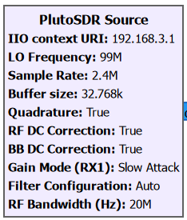
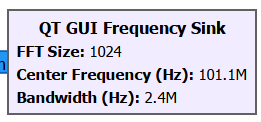
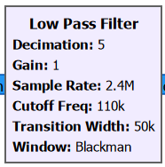
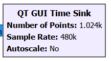
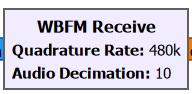
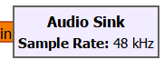
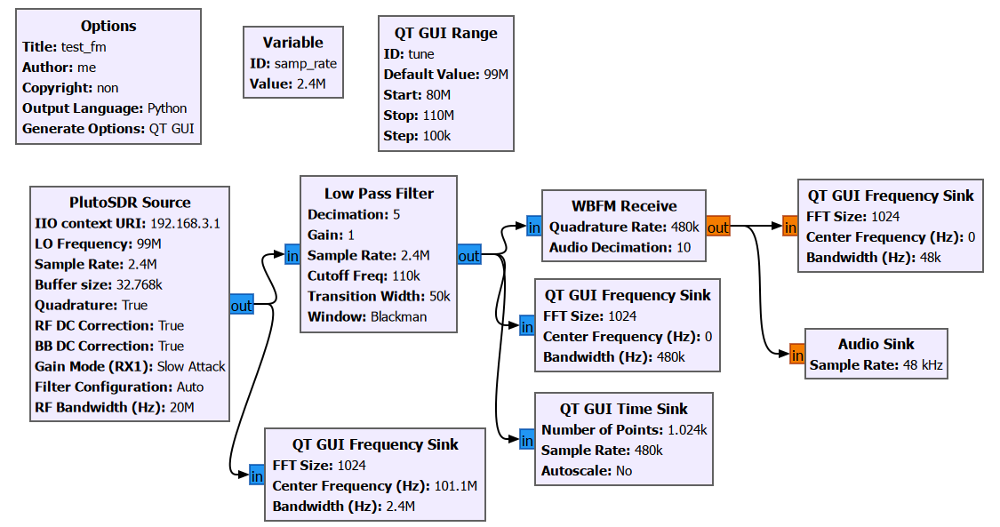
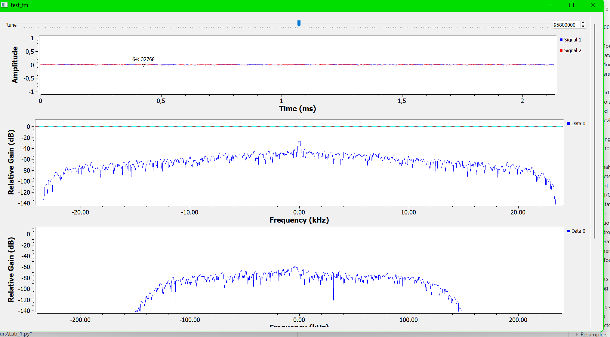

# Отчёт по учебной практике

## **Занятие №1**

---

## 1. Лекционная часть
**Тема:** Основы структурной схемы цифровой радиосвязи.

**PlutoSDR Source**
* Привязать блок к реальному устройству посредством переменной `IIO context URI`.
* Настроить на несущую частоту реального FM-радиопередатчика.
* Задать `Sample Rate` через внешнюю переменную. Остальные параметры оставить без изменения.

**QT GUI Frequency Sink**
* Отображает спектральную плотность мощности. Помогает визуально и более точно найти FM-частоту.

**Low_Pass_Filter**
* Подавляет «лишний» сигнал на частотах вне полосы FM-станции.
* `Cutoff Freq` определяет половину ширины полосы (для FM — 200 kHz).
* `Decimation` (прореживание) снижает частоту дискретизации до аудио-формата ~48 kHz (избавляемся от каждого пятого сэмпла).
* Для контроля результата после фильтра добавляется `QT GUI Freq. Sink`.

**QT_GUI_Time_Sink**
* Позволит отобразить сигнал во временной шкале.

**WBFM_Receive [8]**
* Демодулирует широковещательный FM-сигнал. Параметр `Decimation` настраивается под sample rate выходного аудиопотока.

**Audio_Sink**
* Воспроизведение аудиопотока в динамиках\наушниках компьютера.

**Итоговая схема выглядит след. образом:**

---

## 2. Практическая часть
**Ход выполнения работы и устранение неполадок**

Для сборки радиоприемника потребовалось:
* Устройство SDR (Adalm-Pluto SDR);
* Динамики или наушники;
* Приложение GNU Radio Companion.

В процессе практической сборки и настройки схемы был выявлен ряд проблем, которые удалось успешно решить:

1. **Проблема с прошивкой SDR-устройства**
   При первом запуске собранной схемы наблюдались сильные помехи, сигнал не декодировался. Программа не выдавала всплывающих окон с ошибками, однако анализ системного вывода в терминале указал на сбой в работе прошивки Adalm Pluto SDR. После замены оборудования на устройство с актуальной и корректной прошивкой проблема ушла, но лишь частично.

2. **Проблема с перестройкой частоты (QT GUI Range)**
   При дальнейшей попытке найти радиостанции сохранялся высокий уровень шума. Изменение частоты не приводило к настройке на новые станции: программа либо усиливала сигнал одной и той же мелодии, либо просто усиливала эфирный шум. 
   
   В ходе проверки связей в схеме была обнаружена ошибка при настройке блока `QT GUI Range`. Опираясь на пример из методического пособия, в поле `ID` было ошибочно вписано числовое значение. На самом деле это поле должно задавать строковый идентификатор переменной (например, `tune`), который затем используется для динамического управления параметрами других блоков. Из-за этой ошибки ползунок изменения частоты графического интерфейса никак не влиял на реальную частоту приемника.

**Итог:** 
После исправления идентификатора в поле `ID` блока `QT GUI Range` и привязки этой переменной к соответствующему параметру в блоке `PlutoSDR Source`, перестройка частоты начала функционировать штатно. FM-радиоприёмник успешно заработал, позволив плавно переключаться между радиостанциями.

---

## Список полезной литературы
1. GNU Radio - https://wiki.gnuradio.org/index.php?title=What_Is_GNU_Radio
2. GNU Radio for Windows - https://wiki.gnuradio.org/index.php/WindowsInstall
3. Radioconda - https://github.com/ryanvolz/radioconda
4. Описание блока PlutoSDR Source - https://wiki.gnuradio.org/index.php/PlutoSDR_Source
5. Блок отображения потока данных в виде спектральной плотности мощности (PSD) - https://wiki.gnuradio.org/index.php/QT_GUI_Frequency_Sink
6. Фильтр низких частот - https://wiki.gnuradio.org/index.php/Low_Pass_Filter
7. Визуализация потока данных во времени - https://wiki.gnuradio.org/index.php/QT_GUI_Time_Sink
8. Блок демодуляции FM-сигнала - https://wiki.gnuradio.org/index.php/WBFM_Receive