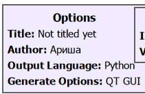
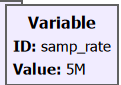
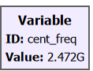
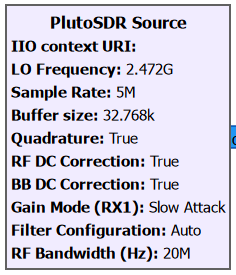
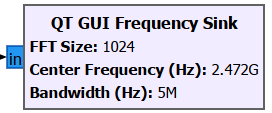
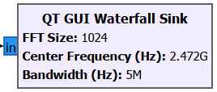
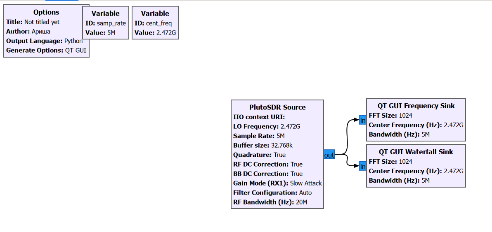
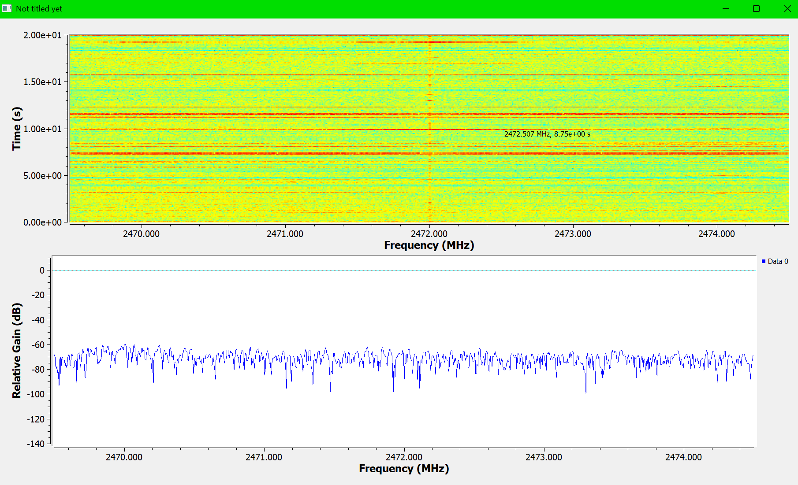

# Отчёт по учебной практике

## **Занятие №2**

---

## 1. Лекционная часть
**Тема:** Основы структурной схемы цифровой радиосвязи.

**Options**
* Задает основные глобальные параметры схемы (flowgraph), такие как заголовок проекта, автор и графический инструментарий (QT GUI). Обязательный системный блок.

**Variable (2 шт.)**
* Используются для задания глобальных переменных, которые применяются для настройки других блоков. В данной схеме создано две переменные:
  * `samp_rate` со значением `5M` (5 МГц). Задает частоту дискретизации. Полосы в 5 МГц достаточно, чтобы отчетливо наблюдать активность в пределах выбранного Wi-Fi канала.
  * `cent_freq` со значением `2.472G` (2472 МГц). Задает центральную несущую частоту. Именно на этой частоте работает 13-й канал Wi-Fi (стандарт для региона, включая Новосибирск).

**PlutoSDR Source**
* Принимает радиосигнал из эфира через физическое устройство Adalm-Pluto SDR.
* Параметры частоты и частоты дискретизации привязываются к ранее созданным переменным `cent_freq` и `samp_rate`.

**QT GUI Frequency Sink**
* Отображает спектральную плотность мощности (спектр сигнала). 
* Позволяет в реальном времени видеть распределение энергии по частотам. При активной передаче данных с точки доступа на графике появляются характерные широкополосные "горбы".

**QT GUI Waterfall Sink**
* Отображает спектрограмму ("водопад"), где по оси X — частота, по оси Y — время, а цветом (от синего к красному) обозначается интенсивность сигнала.
* Идеально подходит для анализа цифрового трафика: позволяет наглядно увидеть пакетную передачу данных Wi-Fi в виде цветных всплесков на временной шкале при загрузке интернета.

---

## 2. Практическая часть
**Ход выполнения работы**

Для второй лабораторной работы потребовалось:
* Устройство SDR (Adalm-Pluto SDR);
* Ноутбук и смартфон с функцией точки доступа Wi-Fi;
* Приложение GNU Radio Companion.

В ходе практической части мы создали новую схему в GNU Radio для перехвата и визуализации трафика Wi-Fi. 

**Основные шаги:**
1. **Настройка точки доступа:** На мобильном телефоне была включена раздача интернета (Wi-Fi точка доступа). Ноутбук был успешно подключен к этой мобильной сети.
2. **Определение канала и частоты:** Было определено, что точка доступа работает на **13-м канале** Wi-Fi. Центральная частота для 13-го канала в диапазоне 2.4 ГГц составляет **2472 МГц** (2.472 GHz).
3. **Настройка SDR:** В GNU Radio Companion был создан новый проект и собрана схема радиоприемника. В качестве источника был настроен блок `PlutoSDR Source` на несущую частоту 2472 МГц для захвата сигнала нашей точки доступа.
4. **Визуализация трафика:** Во время активной передачи данных (использование мобильного интернета на ноутбуке) мы наблюдали за изменениями в эфире. С помощью графических блоков (анализаторов спектра) был наглядно отрисован проходящий Wi-Fi трафик.

---

## Итоги:
В ходе выполнения второй лабораторной работы была успешно собрана схема цифрового радиоприемника в среде GNU Radio. Мы на практике изучили принципы работы SDR-устройства (Adalm-Pluto) для анализа сигналов в диапазоне 2.4 ГГц. Путем настройки несущей частоты на 13-й канал Wi-Fi (2472 МГц) удалось в реальном времени отследить активность мобильной точки доступа. Визуализация сигнала с помощью спектроанализатора и графика "водопада" позволила наглядно зафиксировать пакетную передачу цифрового интернет-трафика, подтвердив работоспособность собранной SDR-системы.