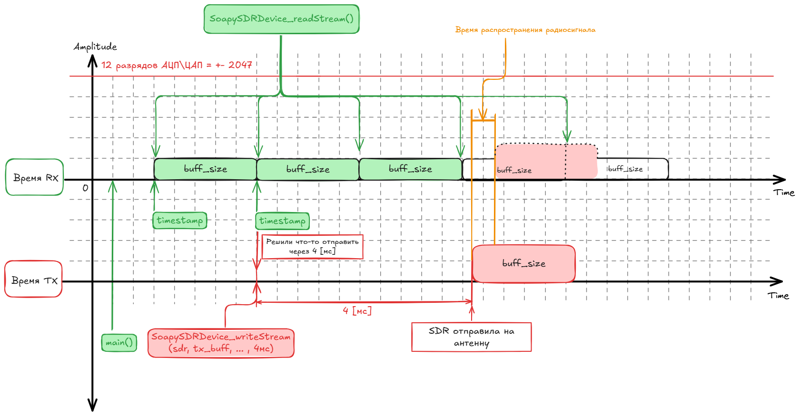
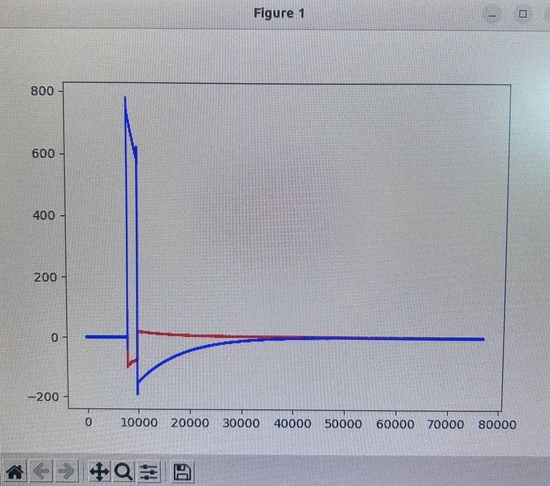

# Отчёт по учебной практике

## **Занятие №3**

---

## 1. Лекционная часть
**Тема:** Знакомство с библиотеками Soapy SDR, Libio для работы с Adalm Pluto SDR. Инициализация SDR-устройства. Работа с буфером: получение цифровых IQ-отсчетов.

В рамках данной работы изучалось программное управление SDR-устройством напрямую из кода на языке C++ с использованием библиотеки **SoapySDR**, минуя графические среды вроде GNU Radio. Особое внимание было уделено работе с буферами и аппаратной синхронизации приёма и передачи.

**Подготовка и установка необходимых библиотек**
Для работы с Adalm-Pluto SDR на низком уровне требуется собрать из исходных кодов (через систему сборки CMake) и установить несколько специализированных библиотек. Установка должна производиться строго в следующем порядке, так как каждая последующая библиотека зависит от предыдущих:
1. **libiio:** Базовая библиотека от Analog Devices (система Industrial I/O). Обеспечивает низкоуровневое взаимодействие с аппаратным обеспечением SDR (связь по USB или сети).
   ```bash
   git clone https://github.com/analogdevicesinc/libiio.git
   cd libiio
   mkdir build && cd build
   cmake ..
   make
   sudo make install
   sudo ldconfig
   ```
2. **libad9361-iio:** Специализированная надстройка над `libiio`. Предоставляет API для тонкого управления радиочастотным трансивером AD9361 — главным чипом, который установлен внутри Adalm-Pluto.
   ```bash
   git clone https://github.com/analogdevicesinc/libad9361-iio.git
   cd libad9361-iio
   mkdir build && cd build
   cmake ..
   make
   sudo make install
   ```
3. **SoapySDR:** Универсальная C++ библиотека (фреймворк). Предоставляет единый, независимый от производителя стандартный API для работы с множеством различных SDR-устройств.
   ```bash
   git clone https://github.com/pothosware/SoapySDR.git
   cd SoapySDR
   mkdir build && cd build
   cmake ..
   make
   sudo make install
   sudo ldconfig
   ```
4. **SoapyPlutoSDR:** Плагин (драйвер-модуль) для SoapySDR. Он связывает универсальный фреймворк с нашим оборудованием, транслируя команды SoapySDR в специфичные вызовы `libiio`.
   ```bash
   git clone https://github.com/pothosware/SoapyPlutoSDR.git
   cd SoapyPlutoSDR
   mkdir build && cd build
   cmake ..
   make
   sudo make install
   ```

**Основные концепции, рассмотренные в методическом материале:**
* **Инициализация SDR (`SoapySDRDevice_make`):** Подключение к устройству через USB или IP-адрес, настройка размера буферов и включение поддержки временных меток.
* **Настройка каналов:** Программное задание несущей частоты (Carrier Frequency), частоты дискретизации (Sample Rate), а также уровня усиления (Gain) для приемника (RX) и передатчика (TX).
* **Потоковая передача данных (Streams):** Создание потоков для приема и передачи. Данные обрабатываются в виде 16-битных комплексных чисел (`SOAPY_SDR_CS16`), где действительная (I) и мнимая (Q) части идут друг за другом. Значения амплитуды ограничены 12-разрядным АЦП/ЦАП (от -2047 до +2047).
* **Одновременный приём и передача (Timestamps):** 
  Это ключевая часть работы для реализации жесткой синхронизации. Обычные ОС не гарантируют точность выполнения кода в микросекундах, поэтому применяется аппаратная синхронизация:
  1. При вызове `SoapySDRDevice_readStream()` считывается буфер приема (RX) размером `buff_size`, и возвращается точная аппаратная метка времени (timestamp) первого сэмпла.
  2. Программа принимает решение об отправке данных (TX) в будущее.
  3. К полученному timestamp прибавляется задержка (например, 4 мс).
  4. С помощью `SoapySDRDevice_writeStream()` TX-буфер отправляется на устройство с указанием вычисленного времени. SDR аппаратно отправит данные на антенну строго в этот момент.
  5. При анализе сигнала также необходимо учитывать физическое время распространения радиосигнала.



* **Постобработка:** Запись полученных `I/Q` сэмплов в бинарный файл (`.pcm`) для дальнейшего парсинга и визуализации с использованием Python (`numpy`, `matplotlib`).

### Фрагменты кода и примеры 

**1. Сэмплы и буферы**
Для обмена данными с устройством память под буферы выделяется на основе MTU (Maximum Transmission Unit) — максимального размера пакета, который SDR может обработать за один раз. Так как каждый сэмпл состоит из двух частей (I и Q), размер массива удваивается:
```cpp
// Получение MTU (размера буферов)
size_t rx_mtu = SoapySDRDevice_getStreamMTU(sdr, rxStream);
size_t tx_mtu = SoapySDRDevice_getStreamMTU(sdr, txStream);

// Выделяем память под буферы RX и TX 
int16_t tx_buff[2 * tx_mtu];
int16_t rx_buffer[2 * rx_mtu];
```

**2. Чтение сэмплов из SDR (RX)**
Считывание происходит с помощью функции `SoapySDRDevice_readStream`. Она заполняет наш массив `rx_buffer` и возвращает метку времени `timeNs` первого сэмпла из буфера:
```cpp
void *rx_buffs[] = {rx_buffer};
int flags;         // Флаги состояния
long long timeNs;  // Метка времени (timestamp)

// Читаем буфер из потока
int sr = SoapySDRDevice_readStream(sdr, rxStream, rx_buffs, rx_mtu, &flags, &timeNs, timeoutUs);
```
Важно: переменная `sr` содержит фактическое количество считанных сэмплов, которое может быть меньше `rx_mtu`. Для корректной записи на диск (или обработки) необходимо использовать именно `sr`.

**3. Отправка сэмплов (TX) с учетом Timestamp**
Отправка данных осуществляется с аппаратной привязкой ко времени. Мы вычисляем будущее время передачи (прибавив 4 мс к времени приема) и отправляем буфер с обязательным флагом `SOAPY_SDR_HAS_TIME`:
```cpp
// Вычисляем время отправки (добавляем 4 мс в будущее)
long long tx_time = timeNs + (4 * 1000 * 1000);  

void *tx_buffs[] = {tx_buff};
flags = SOAPY_SDR_HAS_TIME;

// Отправляем буфер на передачу
int st = SoapySDRDevice_writeStream(sdr, txStream, (const void * const*)tx_buffs, tx_mtu, &flags, tx_time, timeoutUs);
```

---

## 2. Практическая часть
**Ход выполнения работы и устранение неполадок**

Для третьей лабораторной работы потребовалось:
* Устройство SDR (Adalm-Pluto SDR);
* Проект на C++ (библиотека SoapySDR);
* Скрипт на Python для визуализации сигнала.

**Возникшие проблемы при работе в ОС Windows:**
Изначально сборка C++ проекта и запуск скриптов производились в ОС Windows. В процессе возник ряд критических проблем, блокирующих выполнение работы:
1. **Потеря устройства системой:** В какой-то момент ноутбук полностью перестал определять Adalm-Pluto SDR в системе — устройство нигде не отображалось.
2. **Сбой драйверов:** Попытка полного удаления и переустановки специализированных драйверов для устройства не принесла никаких результатов.
3. **Ложные подозрения на код:** Изначально предполагалось, что зависания вызваны некорректно переписанным кодом из методички (сбои при выделении памяти или переполнении буфера). Однако проверка показала, что код был написан верно.

**Решение проблемы:**
Было выдвинуто предположение о нестабильной работе RNDIS/USB драйверов Adalm-Pluto в самой Windows. Для проверки гипотезы весь процесс разработки и выполнения кода был перенесён на полноценную **ОС Ubuntu**, установленную на ноутбуке как отдельная операционная система (не виртуальная машина и не WSL). 
Результат: при загрузке в Ubuntu устройство моментально определилось системой. Скомпилированный код успешно заработал с первой попытки без единого изменения в логике. Это полностью подтвердило гипотезу о проблемах на уровне ОС Windows.

---

## Итог:
В ходе работы был получен важный опыт взаимодействия с SDR-оборудованием на низком уровне через API SoapySDR. Мы реализовали аппаратную синхронизацию передачи с помощью Timestamp и на практике столкнулись со спецификой драйверов, решив проблему переходом на ОС семейства Linux. После отладки и запуска на Ubuntu, радиосигнал был успешно записан и корректно отрисован с помощью Python-скрипта:


